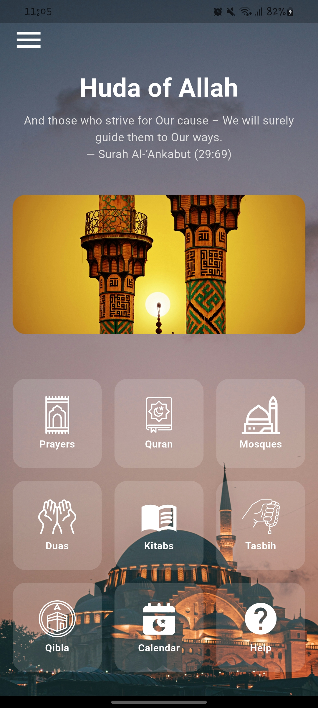
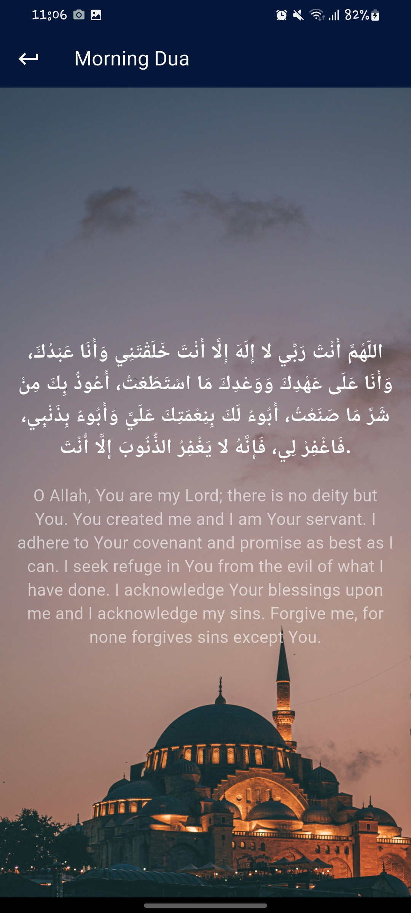
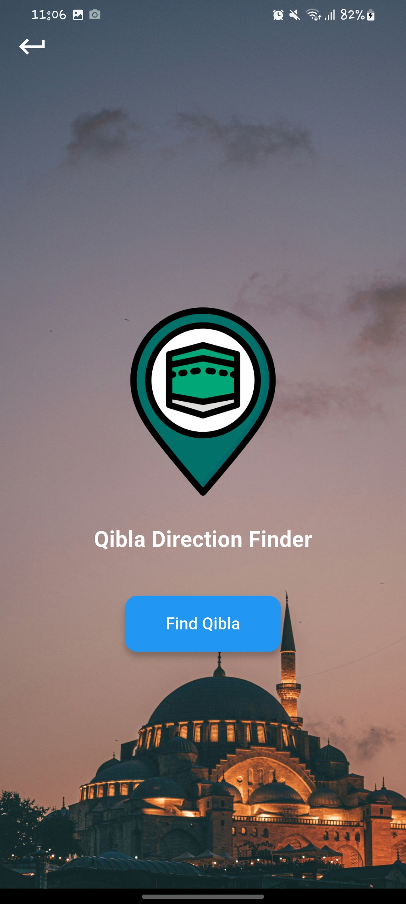

# Huda Islamic

Offline Islamic Companion App for Quran, Duas, Qibla & More — built with Flutter.



---

## ✨ Features

- 📖 **Offline Quran (PDF-based)**
- 🤲 **Daily Duas & Supplications**
- 🧭 **Qibla Direction**
- 📅 **Hijri Calendar**
- 📚 **Islamic Books / Kitabs**
- 🕌 **Nearby Mosque Locator**
- 📌 **Help & Contact Developer Page**

---

## 📸 Screenshots

| Home Screen | Daily Duas | Qibla Direction |
|-------------|------------|-----------------|
|  |  |  |

---

## 🚀 Installation & Setup

```bash
git clone https://github.com/YourUsername/Huda-Islamic.git
cd Huda-Islamic
flutter pub get
flutter run

